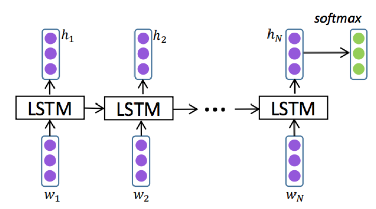
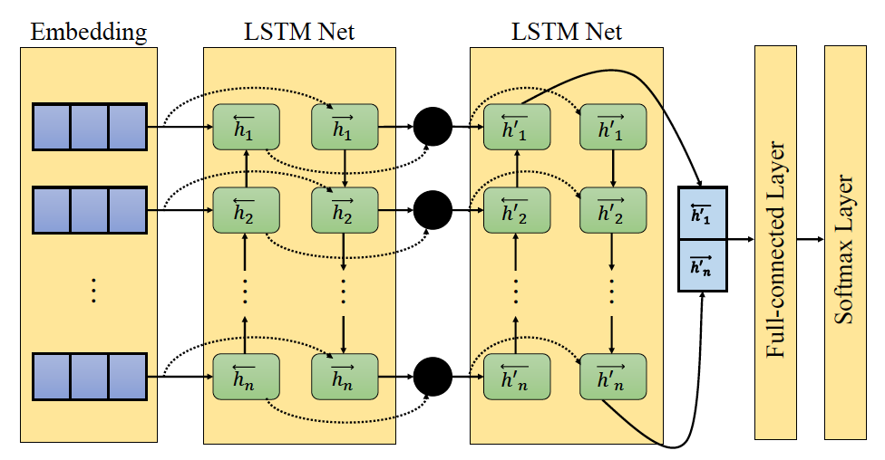

# Neural Network Sentiment Classification
## Introduction
- A general package to learn neural network Sentiment Classification (SC) models, including:
  + RNN (BiRNN), deep-RNN (deep-biRNN)
  + GRU (BiGRU), deep-GRU (deep-biGRU)
  + LSTM (BiLSTM), deep-LSTM (deep-biLSTM)

## SC Model for Predicting Rating Scores of Reviews
We will train a neural network SC model using reviews (as inputs) and rating scores (as labels) on Yelp dataset. Where:  
- Inputs are stored in the *dataset* folder:
  + Train_data (*./dataset/train.small.txt*): used for training a model
  + Dev_data (*./dataset/val.small.txt*): used for validating a model
  + Test_data (*./dataset/test.small.txt*): used for testing a model
- Outputs are saved in the *results* folder:
  + A trained-model file *senti_cls_model-type.m*
  + A model-argument file *senti_cls_model-type.args*

## Repository's Structure
  1. model.py: main script to train the model
  2. predict.py: an interface to generate random text and recommend words given context
  3. utils/
    - core_nns.py: a script to design the neural network architecture
    - data_utils.py: a script to load data and convert to indices
  4. results/: a folder to save the trained models
    - *.m: a trained-model file
    - *.args: a model-argument file
  5. dataset/: a folder to save a tiny dataset
## Design workflow
1. How to train a language model
- Design a model architecture (mainly done in utils/core_nns.py)
- Load a dataset map to indices (mainly done in utils/data_utils.py)
- Feed data to the model for training (mainly done in model.py)
- Save the model into a model file (mainly done in model.py)
- Stop the training process (mainly done in model.py) when  
    + having no improvement on testing data or;
    + exceeding the maximum number of epochs
2. How to predict using a trained model
- Load saved files at the training phase
- Write the ``predict.py`` file to predict rating scores

## Usage
1. Download this repository: git clone https://github.com/duytinvo/comp5014.git
2. Train the model:
  - Change the current directory to "assignment4"
  - Run this command:
    ```
    python model.py [--use_cuda]
    ```
  - See other parameters, this command:
    ```
    python model.py -h
    ```

## Assignment 4

*Figure 1. A UniLSTM model for Sentiment Classification*

*Figure 2. A deep BiLSTM model for Sentiment Classification*

In this assignment, we are going to implement two models (one UniLSTM and one deep BiLSTM ) 
as shown in Figure 1 and Figure 2. Before coding, open new terminal at the **assignment4** repository and run following commands to create 
a virtual environment and install all required libraries:

```commandline
python -m venv venv
source venv/bin/activate
pip install --upgrade pip
pip install -r requirements.txt
```
NOTE: Assume that you are using python3.8 as a default Python version 

1. (40 points) Part 1 - Comprehensive Test

    a. (20 points) What are the purposes of *pack_padded_sequence()*  and *pad_packed_sequence()* functions 
    used at the *get_all_hidden()* method (line 57) in the *core_nns.py* file  
    
    b. (20 points) Why do we need to use *sort_tensors()* and *resort_tensors()* methods at 
    the *forward()* method (line 43) in the *core_nns.py* file  
    
2. (60 points) Part 2 - Model Builder

    a. Implement UniLSTMModel: Let's fill all missing parts at the at the *UniLSTMModel* class in the *core_nns.py* file, 
    including three methods: 
    
    - (20 points) **forward()**: Calculate the un-normalized output scores
     
    - (5 points) **NLL_loss()**: Compute the cross-entropy loss of each batch
    
    - (5 points) **inference()**: Return the top k potential labels with their corresponding probabilities
    
    b. Implement BiLSTMModel: Let's fill all missing parts at the at the *BiLSTMModel* class in the *core_nns.py* file, 
    including one methods: 
    
    - (30 points) **forward()**: Calculate the un-normalized output scores

3. (45 points) Part 3 - Model Trainer

    a. (30 points) Let's fill all missing parts at the **evaluate_batch()** method in the *model.py* file to evaluate a model using 
    some metrics such as loss, accuracy, precision, recall, and F-1 score.
    
    b. (15 points) Train a deep BiLSTM model (called **m1**) using default values provided in the *model.py* file by simply running:
    ```commandline
    python model.py
    ```
   Note: you should train the model using GPU machine for faster training. After training,
   a model file (*.m*) and an argument file (*.args*) should be stored in the **result** folder, which will be used at 
   Part 4.
    
4. (15 points) Part 4 - Model Prediction

    Let's fill all missing parts at the **predict()** method in the *predict.py* file for predicting 
    a rating score given a review document
    
5. (40 points) Part 5 - Model Improvements
    
    a. (20 points) In the *model.py* file, we are using the loss score as the criterion for either 
    storing a new model with better improvement or terminating the training process. 
    Modify codes to use the F-1 score alternatively. Train a deep BiLSTM model (called **m2**) and 
    compare its performance with the performance of **m1** on the testing set using F-1 score.
       
    b. (20 points) Using pre-trained embeddings: Try to modify codes in 5a to use glove embedding for initializing 
    word embedding. Train a deep BiLSTM model (called **m3**) and compare its performance with the performance of 
    **m2** on the testing set using F-1 score.
    
    NOTE: before modifying any file, please copy it into new file named
    **_imp_metric.py* (for 5a) and **_imp_emb.py*  (for 5b). You are required to submit 
    all modified files.

## Submission

Submit a compressed file named **FirstName_LastName_StudentID.zip** on D2L, consisting of:

- One pdf file to answer parts 1
- Your coding files in part 2, 3, 4: *core_nns.py*, *model.py*, and *predict.py* 
- Your coding files in part 5: **_imp_metric.py* (all modified files required in 5a) and 
**_imp_emb.py* (all modified files required in 5b)